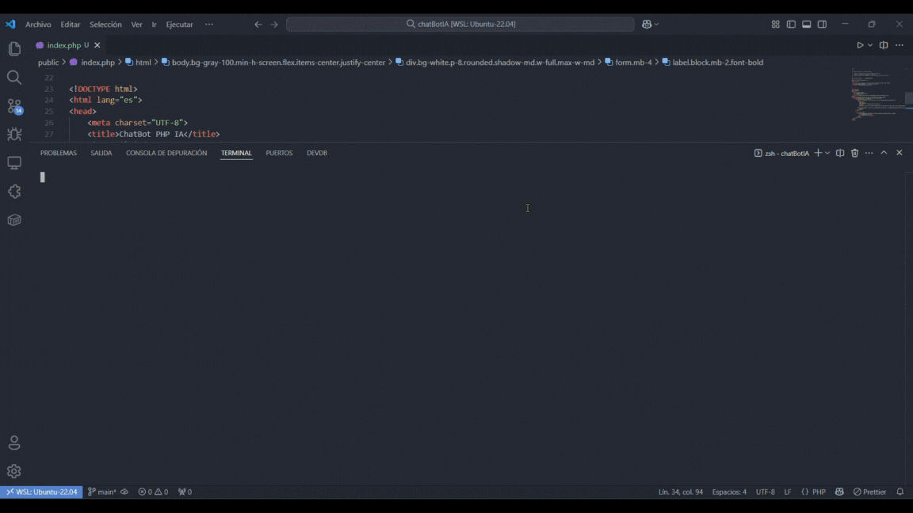
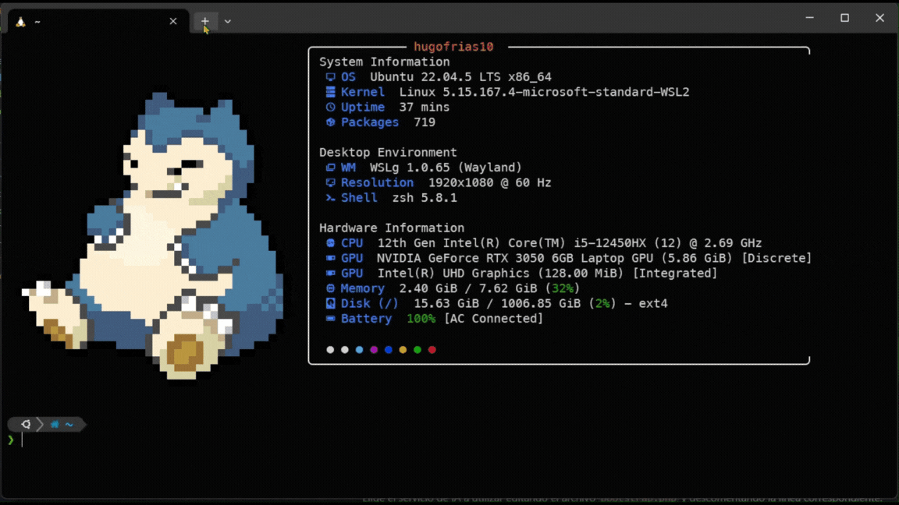

<p align="center">
  
</p>

# ChatBotAI 🤖💬
ChatBotAI es una aplicación desarrollada en PHP que permite interactuar con modelos de inteligencia artificial para obtener respuestas especializadas, especialmente en temas relacionados con PHP. Ofrece una interfaz web moderna y también la posibilidad de usarlo desde la terminal, facilitando su integración en distintos flujos de trabajo.

El chatbot puede conectarse a servicios de IA como OpenAI u Ollama, o funcionar con un modo simulado para pruebas. Su diseño modular y configurable lo hace ideal tanto para desarrolladores que buscan aprender sobre integración de IA en PHP, como para quienes desean una herramienta práctica para consultas técnicas.


> [!TIP]
> ⚡ **Recomendación para un inicio rápido y sin problemas:**
>
 Antes de comenzar, revisa cuidadosamente la configuración de las variables de entorno en el archivo `.env` y selecciona el proveedor de IA que mejor se adapte a tus necesidades. Si es tu primera vez usando PHP > con IA, te recomendamos iniciar con el modo simulado para familiarizarte con la aplicación antes de conectar servicios externos. Si utilizas Windows, considera usar WSL o Laragon para garantizar una mayor
 compatibilidad. Por último, consulta las secciones de uso web y terminal para obtener ejemplos.

# 💻 Stack Tecnológico

<ul>
  <li> PHP 8.0+</li>
  <li> Composer</li>
  <li> Tailwind CSS (CDN)</li>

  <li> Uso desde terminal (CLI)</li>
</ul>

# ✨ Características

- 🖥️ Interfaz web responsiva y moderna con Tailwind CSS.
- 🤖 Respuestas especializadas en PHP usando IA (OpenAI, Ollama o simulada).
- ⚙️ Configuración sencilla mediante variables de entorno.
- 🖱️ Uso desde navegador **y** desde la terminal.
- 🧩 Código modular y documentado, fácil de extender.

# ⚙️ Requisitos

> [!NOTE]  
> Asegúrate de tener instaladas todas las dependencias antes de comenzar.

- **PHP** >= 8.0
- **Composer**
- **Sistemas operativos compatibles:**
  -  **Linux**
  -   **macOS**
  -    **Windows** - [WSL](https://learn.microsoft.com/windows/wsl/) (recomendado)

- [**Ollama**](https://ollama.com/).


# 🚀 Instalación rápida

> [!Tip] 
> Sigue estos pasos para instalar y configurar el proyecto localmente.

### 1. Clona el repositorio

```bash
git clone https://github.com/hugofriasmtz/chatBotAI.git
cd chatBotAI
composer install
cp .env.example .env

# Configura tus variables de entorno en .env (API keys, modelo, etc.)
```
### 2. Descargar Ollama y Modelo
Si aún no tienes Ollama instalado, puedes seguir las instrucciones de instalación en su [sitio web oficial](https://ollama.com/docs/installation).
Para usar Ollama, asegúrate de tener el modelo descargado. Puedes hacerlo ejecutando:

```bash
ollama run deepseek-r1:1.5b
```

Elige el servicio de IA a utilizar editando el archivo `bootstrap.php` y descomentando la línea correspondiente.

## 🌐 Uso desde la web

Inicia el servidor de desarrollo de PHP:

```bash
php -S localhost:8000 -t public
```

<p align="center">
  
</p>


Accede a la aplicación desde tu navegador en [http://localhost:8000](http://localhost:8000).

# 🖥️ Uso desde la terminal

Puedes interactuar con el chatbot desde cualquier parte del proyecto ejecutando:

```bash
./bin/ia 
```

<p align="center">
  
</p>

>[!IMPORTANT] 
> Si tienes un error de permisos, otorga permisos de ejecución con:

 ```bash
 chmod +x bin/ia
```
 Esto te permitirá abrir el chat rápidamente desde la terminal en cualquier momento.

## 🛠️ Personalización

ChatBotIA es altamente configurable. Puedes modificar los mensajes del sistema en los servicios de IA para ajustar el comportamiento del chatbot según tus necesidades.

El proyecto está diseñado para ser fácilmente extensible, permitiendo la integración de nuevos proveedores de IA o la adición de funcionalidades personalizadas.

¿Tienes ideas para mejorar ChatBotAI? ¡Las contribuciones son siempre bienvenidas!  
Puedes colaborar realizando un **fork** del repositorio y enviando un **pull request** con tus mejoras, correcciones o nuevas funcionalidades. Antes de comenzar, asegúrate de revisar las pautas de contribución para facilitar el proceso.


# 👨‍💻 Desarrollador

- **Hugo Frías - Programador Jr**  

  [](https://github.com/hugofriasmtz)  
  [](https://www.linkedin.com/in/hugofriasmtz/)